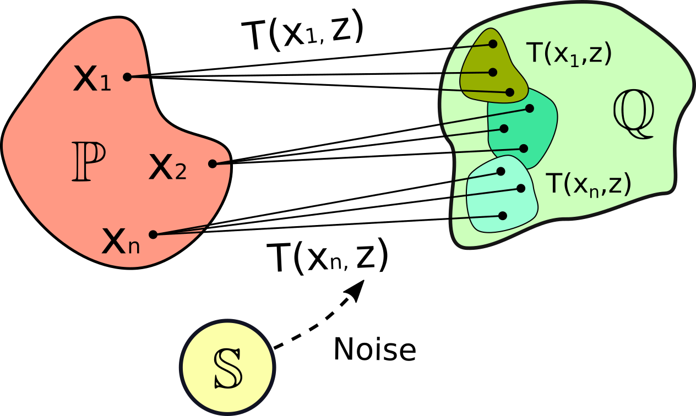
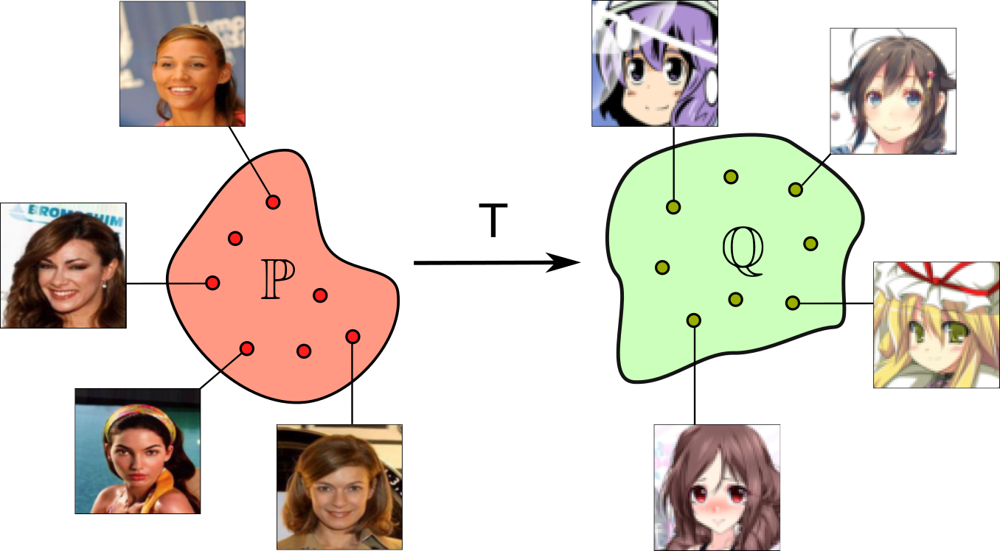
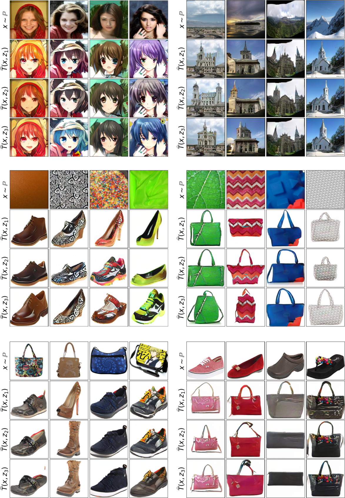
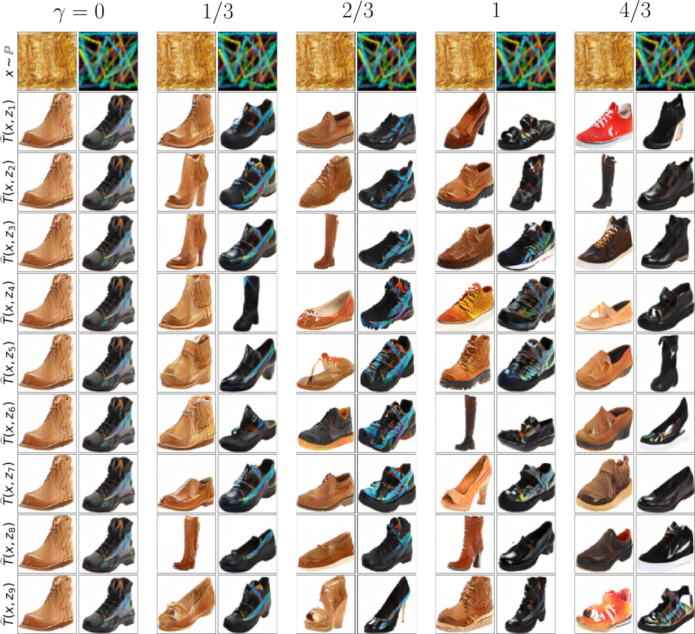

# Kernel Neural Optimal Transport (NOT)
This is the official `Python` implementation of the [ICLR 2023](https://iclr.cc) paper **Kernel Neural Optimal Transport** (paper on [openreview](https://openreview.net/forum?id=Zuc_MHtUma4)) by [Alexander Korotin](https://scholar.google.ru/citations?user=1rIIvjAAAAAJ&hl=en), [Daniil Selikhanovych](https://scholar.google.com/citations?user=ZpZhN3QAAAAJ&hl=en) and [Evgeny Burnaev](https://scholar.google.ru/citations?user=pCRdcOwAAAAJ&hl=ru).

The repository contains reproducible `PyTorch` source code for computing **optimal transport** (OT) **plans** for the *weak kernel* costs in high dimensions with neural networks. Examples are provided for toy problems (1D, 2D) and for the unpaired image-to-image translation task for various pairs of datasets. The implementation of the latter contains *distance-based*, *laplacian*, *exponential* and *bilinear* kernels.

<p align="center"></p>

## Presentations
- [Short Talk](https://iclr.cc/virtual/2023/poster/11992) by Daniil Selikhanovych at [ICLR 2023](https://iclr.cc/Conferences/2023) (May 2023, EN)

## Seminars and Materials
- Seminar and solutions on NOT with **weak** costs (TO DO);
- Vector \*.svg [sources](https://github.com/iamalexkorotin/KernelNeuralOptimalTransport/blob/main/pics/KNOT_figures.svg) of the figures in the paper (use [inkscape](https://inkscape.org/) to edit);

## Related repositories
- [Repository](https://github.com/iamalexkorotin/NeuralOptimalTransport) for [Neural Optimal Transport](https://arxiv.org/abs/2201.12220) paper (ICLR 2023).
- [Repository](https://github.com/justkolesov/Wasserstein1Benchmark) for [Kantorovich Strikes Back! Wasserstein GANs are not Optimal Transport?](https://arxiv.org/abs/2206.07767) paper (NeurIPS 2022).
- [Repository](https://github.com/iamalexkorotin/Wasserstein2Benchmark) for [Do Neural Optimal Transport Solvers Work? A Continuous Wasserstein-2 Benchmark](https://arxiv.org/abs/2106.01954) paper (NeurIPS 2021).

## Citation
```
@inproceedings{
    korotin2023kernel,
    title={Kernel Neural Optimal Transport},
    author={Korotin, Alexander and Selikhanovych, Daniil and Burnaev, Evgeny},
    booktitle={International Conference on Learning Representations},
    year={2023},
    url={https://openreview.net/forum?id=Zuc_MHtUma4}
}
```

## Application to Unpaired Image-to-Image Translation Task
The unpaired domain translation task can be posed as an OT problem. Our NOT algorithm with kernel costs is applicable here. It searches for a transport map with the minimal transport cost (we use kernel $\ell^{2}$). It naturally aims to preserve certain image attributes during the translation.
<p align="center"></p>

Compared to the popular image-to-image translation models based on GANs or diffusion models, our method provides the following key advantages
- **[controlable](https://github.com/iamalexkorotin/KernelNeuralOptimalTransport#controlling-the-amount-of-diversity) amount of diversity** in generated samples (**without** any duct tape or heuristics); 
- **better interpretability** of the learned map.

Qualitative examples are shown below for various pairs of datasets (at resolutions $128\times 128$).

### One-to-many translation (weak kernel cost)
We show unpaired translition with NOT with the $\gamma$-weak kernel cost on *celeba (female) → anime*, *outdoor → church*, *handbags → shoes*, *texture → shoes*, *texture → handbags*, *handbags → shoes*, *shoes → handbags*  datasets.
<p align="center"></p>

### Controlling the amount of diversity
Our method offers a single parameter $\gamma\in[0,+\infty)$ in the weak kernel cost to control the amount of diversity.
<p align="center"></p>

## Repository structure
The implementation is GPU-based with the multi-GPU support. Tested with `torch== 1.9.0` and 1-4 Tesla V100.

All the experiments are issued in the form of pretty self-explanatory jupyter notebooks (`notebooks/`). For convenience, the majority of the evaluation output is preserved. Auxilary source code is moved to `.py` modules (`src/`). 
- ```notebooks/KNOT_toy_1D.ipynb``` - toy experiments in 1D (weak kernel costs);
- ```notebooks/KNOT_toy_2D.ipynb``` - toy experiments in 2D (weak kernel costs);
- ```notebooks/KNOT_training_weak.ipynb``` - unpaired image-to-image translation (**one-to-many**, weak kernel costs);
- ```notebooks/KNOT_plots.ipynb``` - plotting the translation results ([pre-trained models](https://disk.yandex.ru/d/PxaapIEnRPu7cA) are needed);
- ```stats/compute_stats.ipynb``` - pre-compute [InceptionV3](https://en.wikipedia.org/wiki/Inceptionv3) statistics to speed up test [FID](https://arxiv.org/abs/1706.08500) computation;

## Datasets
- [Aligned anime faces](https://www.kaggle.com/datasets/reitanaka/alignedanimefaces) (105GB) should be pre-processed with ```datasets/preprocess.ipynb```;
- [CelebA faces](https://mmlab.ie.cuhk.edu.hk/projects/CelebA.html) requires ```datasets/list_attr_celeba.ipynb```;
- Handbags, shoes, churches, outdoor [datasets](https://github.com/junyanz/iGAN/blob/master/train_dcgan/README.md);
- [Describable Textures Dataset](https://www.robots.ox.ac.uk/~vgg/data/dtd/) (DTD).

The dataloaders can be created by ```load_dataset``` function from ```src/tools.py```. The latter four datasets get loaded directly to RAM.

## Credits
- [Weights & Biases](https://wandb.ai) developer tools for machine learning;
- [pytorch-fid repo](https://github.com/mseitzer/pytorch-fid) to compute [FID](https://arxiv.org/abs/1706.08500) score;
- [UNet architecture](https://github.com/milesial/Pytorch-UNet) for transporter network;
- [ResNet architectures](https://github.com/harryliew/WGAN-QC) for generator and discriminator;
- [Inkscape](https://inkscape.org/) for the awesome editor for vector graphics;
- [AugCycleGAN](https://github.com/aalmah/augmented_cyclegan) repository for CondInstanceNorm layer.
